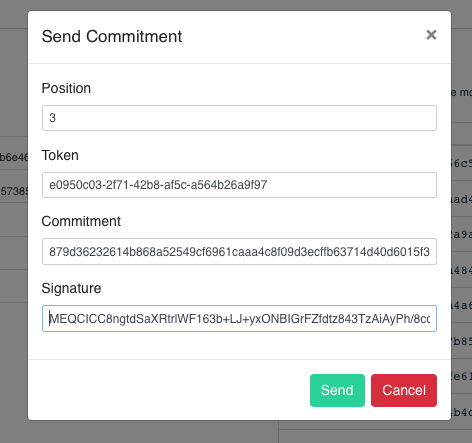

## Commitment examples

### Signing and Sending Commitments

The commitment tool can be used to send signed commitments to the Mainstay API. The commitment is a 32 byte hash. While for a typical Ocean sidechain Client this will be the latest blockhash, any form of data can be hashed into this form. Various tools exist that can achieve this.

To use the commitment tool the client `private key`, `auth token` and `position` assigned during signup are required, along with the 32 byte hash `commitment` to be signed and send.

- The commitment tool can be used one off to produce a signature for a commitment hash using the client's private key:

```
go run cmd/commitmenttool/commitmenttool.go
****************************
****** Commitment mode *****
****************************

Insert commitment: 879d36232614b868a52549cf6961caaa4c8f09d3ecffb63714d40d6015f38229

Sign commitment, send commitment or both? sign

Insert private key: 15918e81d40354eca67b1538e8d3bd2672f8c0016cb36c12fb66042f9d839870

Signature: MEQCICC8ngtdSaXRtrlWF163b+LJ+yxONBIGrFZfdtz843TzAiAyPh/8coCkv8iROeTohAD+yUg5i8Y+Plcx9ZAVobWsdQ==
```

- These data can then be submitted via the Mainstay website:



- Alternatively the commitment tool can be used directly to sign and send the commitment to the Mainstay API:

```
go run cmd/commitmenttool/commitmenttool.go
****************************
****** Commitment mode *****
****************************

Insert commitment: 879d36232614b868a52549cf6961caaa4c8f09d3ecffb63714d40d6015f38229

Sign commitment, send commitment or both? send

Insert signature: MEQCICC8ngtdSaXRtrlWF163b+LJ+yxONBIGrFZfdtz843TzAiAyPh/8coCkv8iROeTohAD+yUg5i8Y+Plcx9ZAVobWsdQ==

Insert position: 3

Insert auth token: e0950c03-2f71-42b8-af5c-a564b26a9f97
response Status: 200 OK
Success!
```

- Or both in one go (or Go):

```
go run cmd/commitmenttool/commitmenttool.go
****************************
****** Commitment mode *****
****************************

Insert commitment: 879d36232614b868a52549cf6961caaa4c8f09d3ecffb63714d40d6015f38229

Sign commitment, send commitment or both? both

Insert private key: 15918e81d40354eca67b1538e8d3bd2672f8c0016cb36c12fb66042f9d839870

Signature: MEQCICC8ngtdSaXRtrlWF163b+LJ+yxONBIGrFZfdtz843TzAiAyPh/8coCkv8iROeTohAD+yUg5i8Y+Plcx9ZAVobWsdQ==

Insert position: 3

Insert auth token: e0950c03-2f71-42b8-af5c-a564b26a9f97
response Status: 200 OK
Success!
```

### Key Init

The commitment tool can also be used to generate private/public ECDSA key pairs if run on `init` mode. This is displayed below:

```
$ go run cmd/commitmenttool/commitmenttool.go -init
2019/01/30 12:29:54 Init mode
2019/01/30 12:29:54 Generating new key...
2019/01/30 12:29:54 generated priv: 15918e81d40354eca67b1538e8d3bd2672f8c0016cb36c12fb66042f9d839870
2019/01/30 12:29:54 generated pub: 021805882d0939594b34f1c31e8d6d9cc19700c6e08cc9d83c267ae318ec52b796
2019/01/30 12:29:54 The private key should be used for signing future client commitments
2019/01/30 12:29:54 The public key should be provided when posting these to Mainstay API
2019/01/30 12:29:54 Finishing...
```

### Commitment Verification

To verify if a commitment has been included in an attestation the following API call can be used:

https://mainstay.xyz/api/v1/commitment/verify?position=3&commitment=879d36232614b868a52549cf6961caaa4c8f09d3ecffb63714d40d6015f38229

To get more detailed information on the commitment use:

https://mainstay.xyz/api/v1/commitment/commitment?commitment=879d36232614b868a52549cf6961caaa4c8f09d3ecffb63714d40d6015f38229

More information on the Mainstay API can be found on [github](https://github.com/commerceblock/mainstay-mvc/blob/develop/doc/mainstay_api.md).


