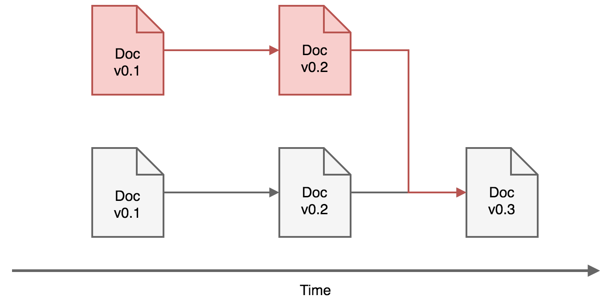
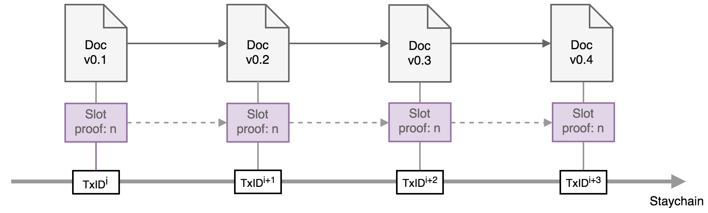
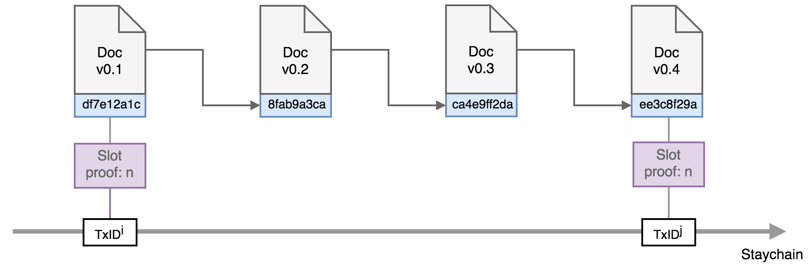

# Mainstay: immutable document history

This document describes an application of the Mainstay service to prove the immutability of the history of a sequence of arbitrary state changes of a specific data object. To illustrate the application of this method, we use the example of trustlessly proving the history of a document consisting of an immutable sequence of changes. 

## Principle and motivation

The concept of timestamping a piece of data or document is well established, and has typically required a trusted notary. The advent of the Bitcoin blockchain now enables distributed and _trustless_ timestamping of arbirary data, where there is an explicit and substantial energy cost (due to the proof-of-work consensus algorithm) required for a malicious party to attempt to change the time-ordering of transactions. The magnitude of the global proof-of-work that secures the ledger means that data added to Bitcoin transactions is practically immutable after several block confirmations. 

There are a number of timestamping services that utilise the Bitcoin blockchain to provide proof that a particular data object (i.e. a document) existed at a particular point in time, by commiting the hash of that document as metadata in a confirmed transaction. The basic protocol for these services operates as follows: 

__Commitment:__

1. A user submits an electronic document to the service to be time-stamped. 
2. A digest of the document is generated with a defined cryptographic hash function (e.g. SHA256)
3. The hash is then added as metadata to a Bitcoin transaction (via OP_RETURN or pay-to-contract). 
4. The transaction (with sufficient fee) is then submitted to the Bitcoin network and confirmed in a valid block, generating a unique transaction ID. 
5. The block in which the transaction is confirmed contains (in the header) a unix epoch time which represents the global consensus (+/- 1 hour). 

Note that, in this approach, the input amounts of the transaction and the output destinations are not relevant to the timestamping function. 

Once the timestamp has been committed to the blockchain, proof that the specified document existed before a particular point (+/- 1 hour) in time can be generated as follows: 

__Proof:__

1. The verifier generates the digest of the document with the defined hash function (SHA256). 
2. The verifier retrieves the raw transaction corresponding to the provided TxID, and confirms it contains meta-data exactly matching the document hash. 
3. The verifier confirms the TxID is included in a block in the fully validated Bitcoin blockchain. 
4. The unix epoch time in the confimation block represents the latest time that the document existed. 

Other services provide more scalable and complex commitment mechanisms that enable many timestamps to be compressed into a single on-chain transaction, saving on Bitcoin transaction fees, however the principle is the same. This kind of proof can be used for many different purposes. For example, providing a publically verifiable proof of priority over an invention or intellectual property. 

This type of trustless timestep represents a _Proof of Existance_ - that a specified piece of data existed at a particular time. What it cannot do however is prove the provenance or _exclusivity_ of that data: it cannot prove that an alternative version of that document was not also timestamped at the same time. This is equivalent to proving a negative - something that is impossible in an unbounded system, but is the very thing that Bitcoin was invented to solve within a consensus system - i.e. to ensure that no two transactions spending the same coins can exist (within the ledger). 

The Bitcoin blockchain along with the Mainstay protocol then enables us to create not only a proof that something existed at a certain point in time, but also a trustless proof that something has only a single possible history - a _Proof of Immutable State_. This can be used to prove the immutability of a sidechain, but also has other applications, as illustrated in the following example. 

Suppose that a complex and contentious document (such a medical or scientific research paper) is published at a certain point in time, and attracts criticism and controversy for its conclusions and methodology. Regulators or auditors may demand to see the sequence of changes to the document from the earliest draft through to the final published version (it is a requirement to track these changes and store them for all publicly funded scientific research in the UK). This sequence of changes is often reviewed to see if the authors changed the initial hypothesis to better fit the results, or otherwise changed the narrative or conclusions of the paper in a dishonest way. 

  

  <b>Fig. 1</b>: Illustration of a sequence of documents that are timestamped. An alternative history (red documents) can also be verifiably timestamped. 

  

A trustless timestamp of the first draft can be provided to prove that this document existed on a certain time and date, however this does not prove that this is the _real_ first draft corresponding to the single genuine history of the document. For example, dishonest authors may have timestamped several different first drafts with different hypothoses at the same time at the start of the drafting, giving them the option of changing the 'original' hypothesis later on after the results of the experiment or study are known. 

The Mainstay protocol can be used to generate a trustless proof that the final published version of a document is a direct result of a sequence of revisions that trace back to a single initial version, and that no alternate histories of the document exist that can be claimed as genuine in hindsight. By committing the document to a defined and verifiable _staychain_ (at a defined `slotid`) sequential versions can be immutably linked after the fact. 

## Protocol

The process of generating a proof of a document history immutability can be done in two different ways, both of which require an allocated `slotid` for a specified staychain (which is designated by the _base_ transaction ID `TxID0`). This allocation is achived via a service agreement with the Mainstay connector service provider. The allocation provides the service user with API access credentials, and the service user provides the service provider with a EC public key to be used to authenticate the user commitments. 

### Version 1

The first mechanism is most appropriate when the frequency of recorded changes to the document (versions) is significantly lower than the frequency of Bitcoin staychain commitment transactions. In this case, the protocol operates as follows:

1. The initial version of the document (e.g. v0.1) is hashed (with SHA256) and the commitment (`com`) submitted to the mainstay API at `slotid` (with authentication credentials and commitment signature). Each version of the document must have the staychain identifier `slotid||TxID0` appended to the end of it before hashing. This is required to immutably link the document to the staychain and slot. 
2. The slot proof is then retrieved from the mainstay API after confirmation (with the staychain height `hs`). 
3. If a new version of the document is not generated before the next staychain attestation, the previous `com` is re-used. The slot proof for each repeated attestation is required. 
4. When a new version of the document is recorded (e.g. v0.2) the hashed commitment is again submitted to the mainstay API at `slotid`, and the corresponding slot proof is retrieved. 
5. As each new version of the document is recoded, this is repeated. 

  

  <b>Fig. 2</b>: Proof of document history with each new version of the document committed to a slot (n) is sequential staychain transactions. 

  

To verify the history of the document then simply involves verifying the sequence of committed changes against the staychain via the sequence of slot proofs. This verification consists of the following steps:

1. Verify that each document version includes the staychain identifier (`slotid||TxID0`). 
2. Verify that each document version hash is committed to to the staychain via a sequence of slot proofs in `slotid`
3. Verify that the sequence of slot proofs are committed to a continuous sequence of staychain transactions. 

This last step is an essential part of the verification of unique history - each transaction on the staychain must be linked to the document history (even if no changes are made). This ensures a separate history is not possible to be committed in parallel (e.g. two histories could be committed to every other staychain transaction alternately). Here, the proof of immutable history depends on verifying the _links_ between states committed to the staychain. 

This verification can be performed via an automated tool that imports the sequence of documents (each with the corresponding slot proof) and then performs the verification with a full Bitcoin client node. 

### Version 2

The second mechanism is required if document revisions are to be recorded _more_ frequently than the than the staychain attestations. In this case, where changes to the document occur independently of a slot commitment, the versions of the document must be linked in a hash chain. This proves the history of the document _between_ the Bitcoin staychain attestations. The protocol for producing a verifiable hash-chain of the document changes is as follows:

1. The initial document version (v0.1) is hashed (with SHA256) and the `com` is submitted to the mainstay API at `slotid`. 
2. The next version of the document (v0.2) is then appended with the hash of the previous version (in addition to the slot identifier) i.e. `slotid||TxID0||com`. 
3. Each subsequent document version is then appened with the hash of the previous version. 

  

  <b>Fig. 3</b>: Proof of document history with each new version of the document forming part of a hash-chain between sequential staychain commitments. 

  

The latest document hash is always submitted to the mainstay API at the `slotid`, for commitment to the staychain. The verification of the document history is performed with the same protocol as above, however in addition the document hash chain is verified to prove the sequence of changes between slot attestations. 

